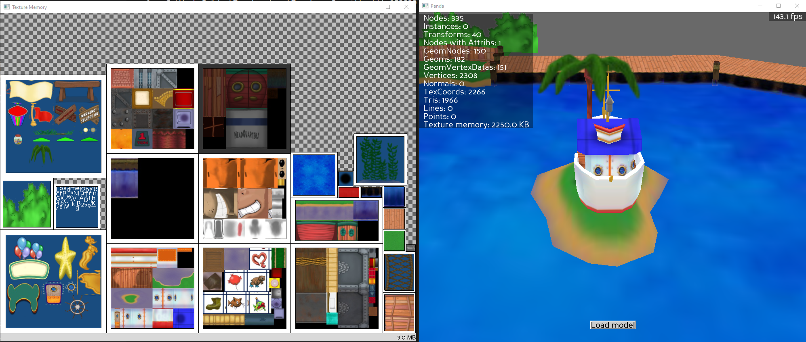

# Texture Memory Viewer Demo

## [*For a detailed & comprehensive guide on utilizing the texture memory viewer tool, click here.*](./doc/README.md)

There are two python scripts provided here. ``texmem_demo`` is a **demo** and ``texmem_explore`` is a **utility.**

- Run ``texmem_demo`` to see a demonstration of Panda's Texture Memory Viewer utility.
    - If you are a novice or have little/no experience in Panda3D development, I *strongly* recommend [starting here first.](./doc/README.md)

- Run ``texmem_explore`` to inspect BAM/EGG files with the utility.

# Caveats

Panda's Texture Memory Viewer application can be a bit buggy. The program may crash when trying to open up various BAM/EGG files. As a workaround, I recommend upscaling the texture memory viewer window before opening a new model.

# Usage

Before running ``run_explore.bat``, configure ``DEV_P3D`` to point to a directory with Toontown's resources (phase folders, extracted)
## Controls

Key | Usage
------------ | -------------
1 | Toggle OOBE (Out of body experience)
2 | Toggle OOBE culling
3 | Show the camera's frustum
a | Output info about the rendered scene
r | Reset camera position
c | Clear the loaded scene
t | Toggle textures

# Todo

- Figure out if there's a way to define the default window size for tex mem on launch.