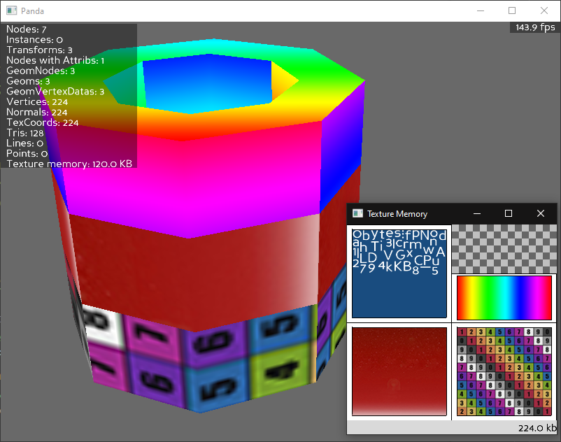
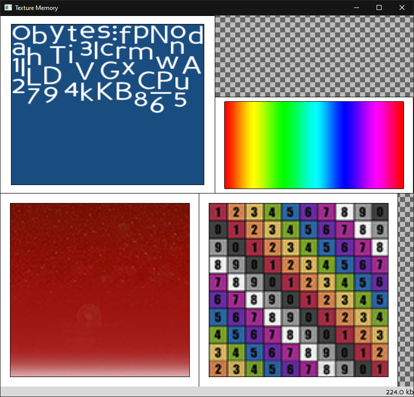
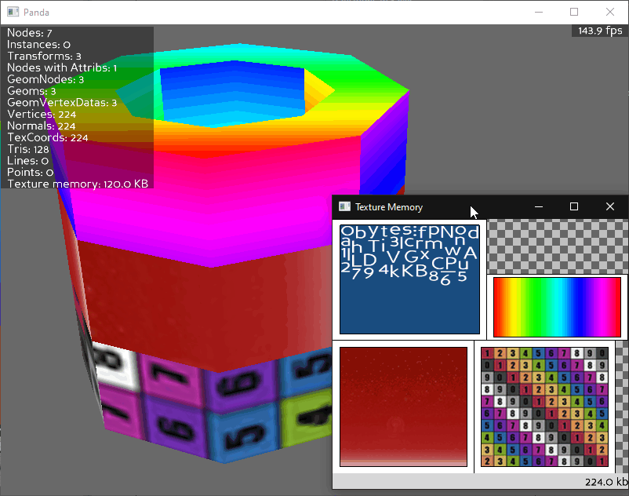

# Texture Memory Viewer Demo

## [*For a straightforward explanation on utilizing the texture memory viewer tool, click here.*](../README.md)

# What's this used for?
- > Creates a separate graphics window that displays an approximation of the current texture memory, showing the textures that are resident and/or active, and an approximation of the amount of texture memory consumed by each one.
- > Intended as a useful tool to help determine where texture memory is being spent.
- Finding texture-related memory leaks (i.e. images not cleaning up)
- Seeing a graphical representation of currently loaded textures

## Disclaimer

- The tool doesn't actually know how the textures are physically laid out in memory. Because of this, the arrangement of textures in the memory window occasionally rearranges to make room to display other textures stored in memory. **It is not binded to the physical placement of textures in the memory!**
    - > __This tool can't be used to research texture memory fragmentation issues.__

[*Quote sources*](https://docs.panda3d.org/1.10/python/reference/direct.showutil.TexMemWatcher#direct.showutil.TexMemWatcher.TexMemWatcher)

# The Interface

* Textures that are lit up are actively being called to render.

* Textures that are *dimmed* indicate that they are still in memory, however are not being actively called for during render.

* Clicking on an image in the viewer will isolate that texture in the viewer and flash in the scene.

# Loading Models

# Extra References
https://docs.panda3d.org/1.10/python/reference/direct.showutil.TexMemWatcher#module-direct.showutil.TexMemWatcher