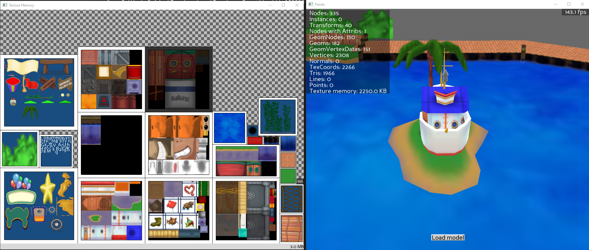

# Texture Memory Viewer Demo

## [*For a straightforward explanation on utilizing the texture memory viewer tool, click here.*](../README.md)

# What's this used for?
- > Creates a separate graphics window that displays an approximation of the current texture memory, showing the textures that are resident and/or active, and an approximation of the amount of texture memory consumed by each one.
- > Intended as a useful tool to help determine where texture memory is being spent.
- Finding texture-related memory leaks (i.e. images not cleaning up)
- Seeing a graphical representation of currently loaded textures

## Caveats

- The tool doesn't actually know how the textures are physically laid out in memory. Because of this, the arrangement of textures in the memory window occasionally rearranges to make room to display other textures stored in memory. **It is not binded to the physical placement of textures in the memory!**
    - > __This tool can't be used to research texture memory fragmentation issues.__

Additionally, Panda's Texture Memory Viewer application can be a bit buggy. The program may crash when trying to open up various BAM/EGG files. As a workaround, **I recommend upscaling the texture memory viewer window before opening a new model.**

[*Quote sources*](https://docs.panda3d.org/1.10/python/reference/direct.showutil.TexMemWatcher#direct.showutil.TexMemWatcher.TexMemWatcher)

# The Interface

* Textures that are lit up are actively being called to render.

* Textures that are *dimmed* indicate that they are still in memory, however are not being actively called for during render.

* Clicking on an image in the viewer will isolate that texture in the viewer and flash in the scene.

# Loading Models

As a sample, I'm going to open up the Donalds Dock playground. You can find the model at ``phase_6/models/playgrounds/donalds_dock.bam``

Moving around the camera with your mouse, you may see new textures pop up in the window and some dim in color.

As you can see here, we can easily identify the locations of specific textures currently loaded in with the playground.

Now, I'm going to load in the Minnie's Melodyland playground. The tool will automatically clear out all of the nodes in the scene upon loading a new model. You can find the model at ``phase_6/models/minnies_melody_land.bam``

If you look at the texture editor here, you may see some remnants of textures that were called for Donald's Dock, but have no use in Melodyland. By default, previously loaded in textures may still be stored in ram as *cache* until being replaced with a newer called texture.

This is a good thing when it comes graphics that are consistently rendered, such as GUI and Toon textures.

# Experimenting with Texture Memory

Upon opening ``texmem_demo.py``, you will see three ``loadPrcFileData`` calls. By enabling any of these configurations (changing the ``0`` to a ``1``), our scene will behave differently.

# Extra References
https://docs.panda3d.org/1.10/python/reference/direct.showutil.TexMemWatcher#module-direct.showutil.TexMemWatcher